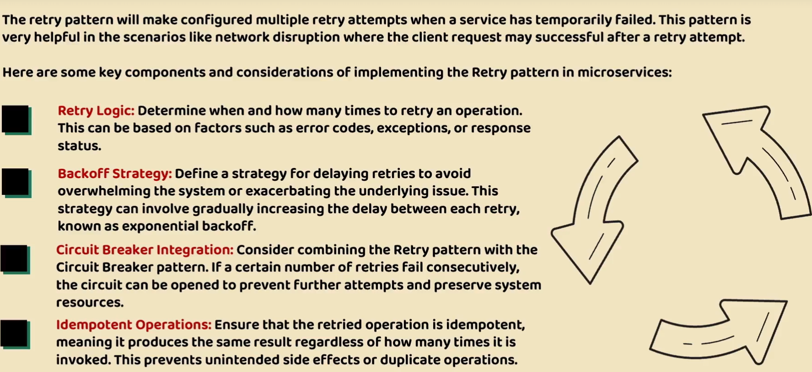

# Microservices Resilience

Implementing Circuit Breaker using Gateway server
------------------------------------------------
1. Add the resilience4j Circuit breaker dependency
2. ```xml
		<dependency>
			<groupId>org.springframework.cloud</groupId>
			<artifactId>spring-cloud-starter-circuitbreaker-reactor-resilience4j</artifactId>
		</dependency>
   ```
3. Add the filter to configure the circuit breaker
   `.circuitBreaker(config -> config.setName("accountsCircuitBreaker")`
4. add configuration in properties
5. ```yaml
    resilience4j.circuitbreaker:
    configs:
    accountsCircuitBreaker:
    slidingWindowSize: 10
    permittedNumberOfCallsInHalfOpenState: 2
    failureRateThreshold: 50
    waitDurationInOpenState: 10000
   ```
6. Add the fallback mechanism
   ```java
		return routeLocatorBuilder.routes()
						.route(p -> p
								.path("/eazybank/accounts/**")
								.filters( f -> f.rewritePath("/eazybank/accounts/(?<segment>.*)","/${segment}")
										.addResponseHeader("X-Response-Time", LocalDateTime.now().toString())
										.circuitBreaker(config -> config.setName("accountsCircuitBreaker").setFallbackUri("forward:/contactSupport")))
								.uri("lb://ACCOUNTS"))
   ```
7. Invoke the api through gateway server and monitor the metrics via actuator
   

   
Circuit Breaker Using feign client
------------------------------
1. add the following dependency in respective microservice
2. ```xml
		<dependency>
			<groupId>org.springframework.cloud</groupId>
			<artifactId>spring-cloud-starter-circuitbreaker-reactor-resilience4j</artifactId>
		</dependency>

   ```
3. Modify the Feign clients to work for feedback
   ```java
   @FeignClient(name="cards", fallback = CardsFallback.class)
   public interface CardsFeignClient {
   
       @GetMapping(value = "/api/fetch",consumes = "application/json")
       public ResponseEntity<CardsDto> fetchCardDetails(@RequestHeader("eazybank-correlation-id")
                                                            String correlationId, @RequestParam String mobileNumber);
   
   }
   ```
4. Add the fallback class
   ```java
   package com.eazybytes.accounts.service.client;
   
   import com.eazybytes.accounts.dto.CardsDto;
   import org.springframework.http.ResponseEntity;
   import org.springframework.stereotype.Component;
   
   @Component
   public class CardsFallback implements CardsFeignClient{
   
       @Override
       public ResponseEntity<CardsDto> fetchCardDetails(String correlationId, String mobileNumber) {
           return null;
       }
   
   }
   ```
5. Add the circuit breaker properties
   ```yaml
   spring:
     cloud:
    openfeign:
      circuitbreaker:
        enabled: true
   
   resilience4j.circuitbreaker:
   configs:
   default:
   slidingWindowSize: 10
   permittedNumberOfCallsInHalfOpenState: 2
   failureRateThreshold: 50
   waitDurationInOpenState: 10000
   ```
6. Access the circuit breaker by microservice actuator circuit breakers endpoint
   


Connect - Response Timeouts
-------
1. To avoid indefinite waiting of thread we can implement timeouts to free out resources
2. By default circuit breaker have some default timeout for every request
3. You can define time out configuration using properties in gateway server 
   ```yaml
   spring
    cloud:
      gateway:
        httpclient:
        connect-timeout: 1000
        response-timeout: 2s
   ```

Retry Pattern
--------------

1. Add the retry config at route level - using Gateway server
   ```java
   .route(p -> p
							.path("/eazybank/loans/**")
							.filters( f -> f.rewritePath("/eazybank/loans/(?<segment>.*)","/${segment}")
									.addResponseHeader("X-Response-Time", LocalDateTime.now().toString())
									.retry(retryConfig -> retryConfig.setRetries(3)
											.setMethods(HttpMethod.GET)
											.setBackoff(Duration.ofMillis(100),Duration.ofMillis(1000),2,true)))
    ```

  
Retry at Microservice level
-------------------------
1. Add retry fallback at method level
   ```java
      @Retry(name = "getBuildInfo",fallbackMethod = "getBuildInfoFallback")
      @GetMapping("/build-info")
      public ResponseEntity<String> getBuildInfo() {
      return ResponseEntity
      .status(HttpStatus.OK)
      .body(buildVersion);
      }
      
          public ResponseEntity<String> getBuildInfoFallback(Throwable throwable) {
              logger.debug("getBuildInfoFallback() method Invoked");
              return ResponseEntity
                      .status(HttpStatus.OK)
                      .body("0.9");
          }
   ```
2. Add the retry config properties - add exceptions that should not be tried more than `once`
   ```yaml
   resilience4j.retry:
   configs:
   default:
   maxRetryAttempts: 3
   waitDuration: 500
   enableExponentialBackoff: true
   exponentialBackoffMultiplier: 2
   ignoreExceptions:
   - java.lang.NullPointerException
   retryExceptions:
     - java.util.concurrent.TimeoutException
   ```
   
Changing the default time of circuit breaker in gateway servers
---------------------------------------------------------------
1. Add Bean of ReactiveResilience4JCircuitBreakerFactory
   ```java
             @Bean
             public Customizer<ReactiveResilience4JCircuitBreakerFactory> defaultCustomizer() {
                 return factory -> factory.configureDefault(id -> new Resilience4JConfigBuilder(id)
                         .circuitBreakerConfig(CircuitBreakerConfig.ofDefaults())
                         .timeLimiterConfig(TimeLimiterConfig.custom().timeoutDuration(Duration.ofSeconds(4)).build()).build());
      }
   ```
   
2. This will override default time of circuit breaker


RateLimiter
------------
1. Add the RateLimiter and Key resolver bean 
   ```java
      @Bean
      public RedisRateLimiter redisRateLimiter() {
      return new RedisRateLimiter(1, 1, 1);
      }
      
          @Bean
          KeyResolver userKeyResolver() {
              return exchange -> Mono.justOrEmpty(exchange.getRequest().getHeaders().getFirst("user"))
                      .defaultIfEmpty("anonymous");
          }

    ```
2. Add the rate limitter in route
   ```java
   .route(p -> p
   .path("/eazybank/cards/**")
   .filters( f -> f.rewritePath("/eazybank/cards/(?<segment>.*)","/${segment}")
   .addResponseHeader("X-Response-Time", LocalDateTime.now().toString())
   .requestRateLimiter(config -> config.setRateLimiter(redisRateLimiter())
   .setKeyResolver(userKeyResolver())))
   .uri("lb://CARDS")).build();
    ```
3.  Add the dependency
```xml
           <dependency>
               <groupId>org.springframework.boot</groupId>
               <artifactId>spring-boot-starter-data-redis-reactive</artifactId>
           </dependency>
```
4. Start the redis server
   
5. Add the redis server info inside gateway server
```yaml
     data:
       redis:
         connect-timeout: 2s
         host: localhost
         port: 6379
         timeout: 1s
```


Adding Rate limiter at microservice level
-----------------------------------------
1. Add the @Retry at method level and fallback
   ```yaml

      @RateLimiter(name= "getJavaVersion", fallbackMethod = "getJavaVersionFallback")
      @GetMapping("/java-version")
      public ResponseEntity<String> getJavaVersion() {
      return ResponseEntity
      .status(HttpStatus.OK)
      .body(environment.getProperty("JAVA_HOME"));
      }
      
      public ResponseEntity<String> getJavaVersionFallback(Throwable throwable) {
      return ResponseEntity
      .status(HttpStatus.OK)
      .body("Java 17");
      }
   ```
2. Add the rate limiter properties
```yaml
   resilience4j.ratelimiter:
     configs:
       default:
         timeoutDuration: 1000
         limitRefreshPeriod: 5000
         limitForPeriod: 1
```

